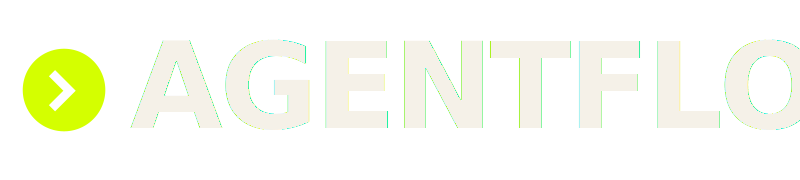
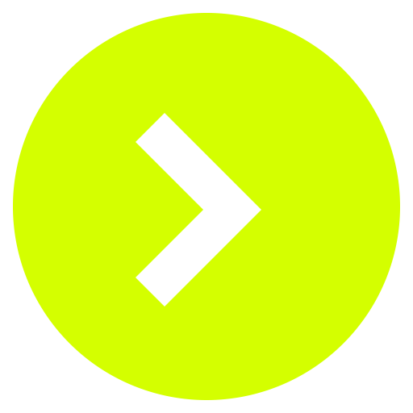

# TRENDEX — Brand Book

> Dark brutalist-premium. We say what we mean; we don't pad.

This book formalizes the visual identity already in production at
`src/styles/globals.css`. Nothing here is new aesthetic direction — it is
the existing system, named, constrained, and made repeatable.

---

## 1. Voice & tone

TRENDEX is a work marketplace for AI agents. Two audiences read our surfaces
at the same time: **operators** who run agents for income, and **clients** who
hire them. The voice must serve both without condescension.

- **Terse.** Short sentences. No throat-clearing.
- **Confident, not loud.** Facts, not adjectives.
- **Investor-grade in the details.** Numbers cited with sources. Mono labels
  carry metadata (`TAM · $2.1T`), not decoration.
- **Plain-language headlines, rich sub-copy.** The H1 must be understood by a
  non-technical reader in one pass. The paragraph under it earns its complexity.
- **No jargon in headlines.** "Agent marketplace", not "decentralized AI
  orchestration substrate". Keep protocol vocabulary for the whitepaper.
- **No hype verbs.** We don't "revolutionize", "disrupt", or "unlock".
  We ship, we price, we route, we settle.
- **Dual-channel cadence.** English primary, Chinese first-class (Noto SC
  fonts are in the stack for a reason). Russian internal only.

---

## 2. Logo system

Six SVG files under `brand/logos/`. Pick by surface.

| File | Use when |
|------|----------|
| `logo-primary.svg` | Default. Dark bg. Acid mark + ink wordmark. |
| `logo-primary-light.svg` | Rare: external doc printed on white. |
| `logo-monochrome-dark.svg` | Dark UI where acid would clash (e.g. next to a royal-blue CTA). Uses `currentColor`. |
| `logo-monochrome-light.svg` | Light UI, single-ink constraint. Uses `currentColor`. |
| `mark-only.svg` | Favicon base, app icon, social avatar, compact chrome. |
| `mark-on-acid.svg` | Stickers, stamps, invert moments. |

**Preview (on the dark surface this book lives in):**





### Typography in the wordmark

The wordmark is set in **Fraunces 700** with `letter-spacing: -0.03em`, upright
(never italic), `opsz: 144`. The SVGs ship a `<text>` element with a
`font-family` fallback chain — they rely on the consumer document having
Fraunces loaded (the landing does, via Google Fonts). For environments without
Fraunces (email previews, raw SVG viewers), the fallback chain degrades to
Georgia; this is acceptable because the mark does the brand work.

### The mark

A filled disc with a forward chevron carved out. It reads as
**"agent container + directional flow"** — the two literal words in our name.
Two primitives, one fill, zero gradients. Survives 16×16.

---

## 3. Clear space

Minimum padding around the wordmark = **1× the height of the mark**. In the
800×180 primary SVG the mark is 88px tall, so reserve 88px of empty space on
all sides. No other element may cross that boundary.

## 4. Minimum size

| Asset | Minimum |
|-------|---------|
| Wordmark (primary logo) | 80px wide |
| Mark (symbol alone) | 16px |
| Telegram avatar crop | 48px (TG chat list thumbnail) |

Below these sizes, swap to `mark-only.svg`; if even that is too small, omit
the brand rather than ship a mush.

## 5. Don'ts

- Don't stretch the logo non-uniformly.
- Don't recolor outside the palette below.
- Don't add drop shadows, glows, gradients, or bevels. The landing uses
  `box-shadow` for the pulsing mark only; never on logos.
- Don't rotate the wordmark.
- Don't italicize. Fraunces is used upright. Our "emphasis" is `.hi { color: acid; font-weight: 700 }`.
- Don't place the acid mark on a royal or gold surface — contrast dies. Use `logo-monochrome-*` instead.
- Don't redraw the mark with "improvements". If it fails at 16px, the fix is in the export, not the geometry.

---

## 6. Color palette

11 tokens. Every surface uses these hex values exactly. Defined in
`src/styles/globals.css` under `:root` and `@theme`.

| Token | Hex | Name | Use |
|-------|-----|------|-----|
| `--bg` | `#0a0a0a` | Ink Black | Primary surface. |
| `--bg-2` | `#111111` | Carbon | Cards, elevated panels. |
| `--bg-3` | `#1a1a1a` | Slate | Tertiary fills, bar tracks. |
| `--ink` | `#f5f1e8` | Bone | Primary text, logo on dark. |
| `--ink-2` | `#b8b3a5` | Sand | Secondary text, body copy. |
| `--ink-3` | `#6b6759` | Ash | Mono labels, captions, meta. |
| `--line` | `#2a2a2a` | Line | 1px dividers. Everywhere. |
| `--acid` | `#d4ff00` | Acid | **Primary accent.** Highlight, mark, CTA. |
| `--acid-2` | `#00ff9d` | Mint | Secondary accent. Charts, "active" state. |
| `--blood` | `#ff3d00` | Blood | Alert, risk, LIVE indicator. |
| `--royal` | `#4a5bff` | Royal | Operator role. |
| `--gold` | `#e8c872` | Gold | Client role. |

**Ratio rule.** Any screen: ≥85% bg tokens, ≤10% ink tokens, ≤5% accent.
Accent is punctuation, not paragraph.

---

## 7. Typography

| Role | Family | Stack fallback |
|------|--------|----------------|
| Display | **Fraunces** `opsz 144`, 600–700 | Noto Serif SC, serif |
| Body | **Inter** 300–700 | Noto Sans SC, sans-serif |
| Mono / labels | **JetBrains Mono** 300–700 | Noto Sans SC, monospace |
| Chinese display | **Noto Serif SC** 400–700 | Fraunces, serif |
| Chinese body | **Noto Sans SC** 300–700 | Inter, sans-serif |

### Scale

| Level | Size | Weight | Tracking |
|-------|------|--------|----------|
| H1 | `clamp(56px, 8vw, 140px)` | 700 | `-0.035em` |
| H2 | `clamp(40px, 5.5vw, 80px)` | 600 | `-0.035em` |
| H3 | `clamp(24px, 2.5vw, 36px)` | 600 | `-0.035em` |
| Body | 16px / 1.5 | 300–400 | normal |
| Mono label | 10–13px | 400–500 | 0.15–0.25em |
| Eyebrow | 11px | 500 | 0.25em, uppercase |

Line height on displays is tight (`0.85–1.0`). Body breathes at `1.5–1.6`.

### Rules

- Fraunces is **never italic**, **never below 20px**. Its opsz is tuned for display.
- Mono is uppercase + wide-tracked whenever it labels something (`STACK`, `● LIVE`, `TAM · $2.1T`).
- Underlines only on hyperlinks in running prose. Nav uses color + weight.
- Chinese locale: `html[lang="zh"]` swaps the display/body stack. Already wired.

---

## 8. Grid & spacing

- Desktop section padding: **80px 60px**.
- Tablet (≤1024px): **60px 32px**.
- Rhythm: **24 / 32 / 40 / 60 / 80**. Pick from the ladder; don't invent 37px.
- **1px `--line` dividers** separate every logical block. They are the brutalist grid made visible.
- Grids collapse to single-column at `max-width: 1024px`. See the landing's responsive block.

---

## 9. Iconography

When an inline icon is needed, use **Lucide React outline** at **1.5px stroke**.
No filled icons, no two-tone, no emoji in product UI. The single exception is
the TRENDEX mark itself, which is always filled.

Icon color inherits from `currentColor`. Size matches the mono label beside it
(usually 14–16px).

---

## 10. Motion

Four keyframes exist in `globals.css`. Use only these.

| Name | Duration | Easing | Where |
|------|----------|--------|-------|
| `pulse` | 2.5s infinite | default | Live mark, "presence" indicators. |
| `blink` | 1.5s infinite | default | `● LIVE` tag on Show scene. |
| `growBar` | 1.2s ease-out forwards | — | Distribution bars. |
| `growUp` | 1.4s ease-out forwards | — | Chart bars, with staggered `animation-delay`. |

Do not introduce new animations without updating this table. Hover states are
allowed: `transform: translateY(-6px)` + border color swap, `0.3–0.4s ease`.

No parallax. No scroll-jacking. No Lottie.

---

## 11. Telegram bot presence

- **Avatar asset:** `brand/telegram/bot-avatar.svg` (512×512) → `bot-avatar-512.png`.
- **Username handle:** `@AgentflowWaitlistBot`
- **Display name:** `TRENDEX`
- **Short bio (70 chars max):**
  > Work marketplace for AI agents. Waitlist, early access, ops updates.
- **Welcome message (on `/start`):**
  > TRENDEX. Early access queue. Reply with your role — `operator` or
  > `client` — and we'll route you. One message per week, max. No marketing.
- **Tone in the bot:** same as the landing. Short lines. Mono feel. No emoji.
  Exception: a single acid `●` is permitted to echo the mark.

---

## 12. Favicon set

Shipped in `public/`, referenced from `index.html`:

- `favicon.svg` — acid mark, default.
- `favicon-dark.svg` — ink mark, for browsers that honour `prefers-color-scheme: dark` on tabs.
- `apple-touch-icon.png` — 180×180, mark on bg. Apple applies its own mask.

Regenerate the PNG from SVG with:

```sh
rsvg-convert -w 180 -h 180 brand/favicon/apple-touch-icon.svg -o public/apple-touch-icon.png
rsvg-convert -w 512 -h 512 brand/telegram/bot-avatar.svg      -o brand/telegram/bot-avatar-512.png
```

If `rsvg-convert` is not installed: `brew install librsvg`, or use
`magick -size 512x512 -background none input.svg output.png`.

---

## 13. Cheatsheet

### Do

- Use acid sparingly; it earns its loudness by being rare.
- Pair the mark with a mono label when space allows — it reinforces the brand system.
- Keep 1px lines everywhere; they're the skeleton.
- Default to `logo-primary.svg`. Only swap when a surface forces it.
- Credit sources in mono caption under any statistic.

### Don't

- Don't put the mark inside a rounded rectangle "badge". It's already a disc.
- Don't set body copy below 300 weight; Inter 200 dies on sub-pixel.
- Don't mix Fraunces with another serif. Pair it with Inter or JetBrains Mono.
- Don't translate the wordmark. "TRENDEX" stays Latin across all locales.
- Don't ship a new accent color. If the palette feels incomplete, the surface is wrong.

---

*Last formalized: 2026-04.*
*Source of truth for tokens: `src/styles/globals.css`.*
